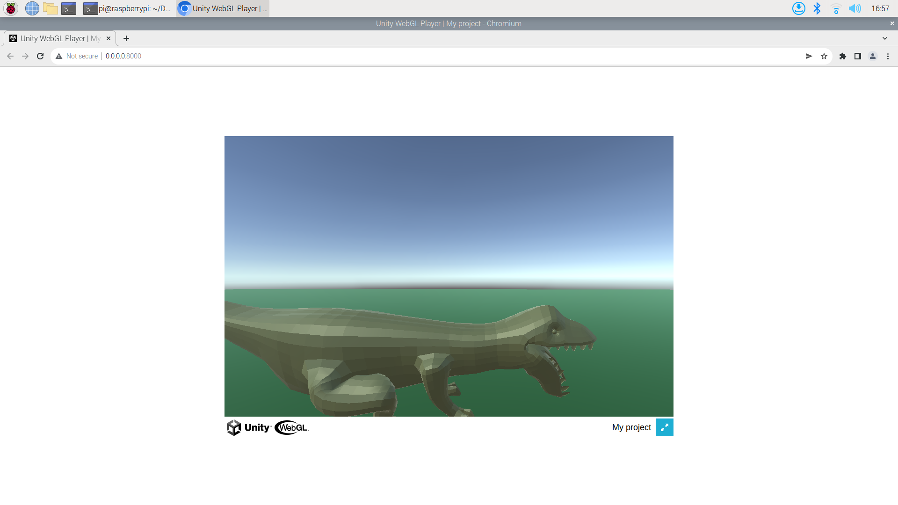

# web-trex
*pronounced web-treks*

The whole loop.

That means: 
- [The Web App](./client) with some controls to control the T-Rex.
- [The Web Sockets Server](./server) which forwards messages from all clients to unity.
- [The Unity Project](./unity) with the T-rex.

## Reproducing

### Azure
Currently port 8000 is used for the Web App, and 9010 is used for the WebSockets server, so these must be configured on the azure portal.

Clone this Repo.
```bash
git clone https://github.com/tomazgda/web-trex.git
```
### Web App
Install python then:
```bash
python3 -m http.server 8000 --directory [PATH_TO/index.html]
```
### WebSockets Server
Follow instructions [here](./server).

### Unity Project
You should be able to just open the directory [unity](./unity) in Unity.

## Image of T-Rex on WebGL



