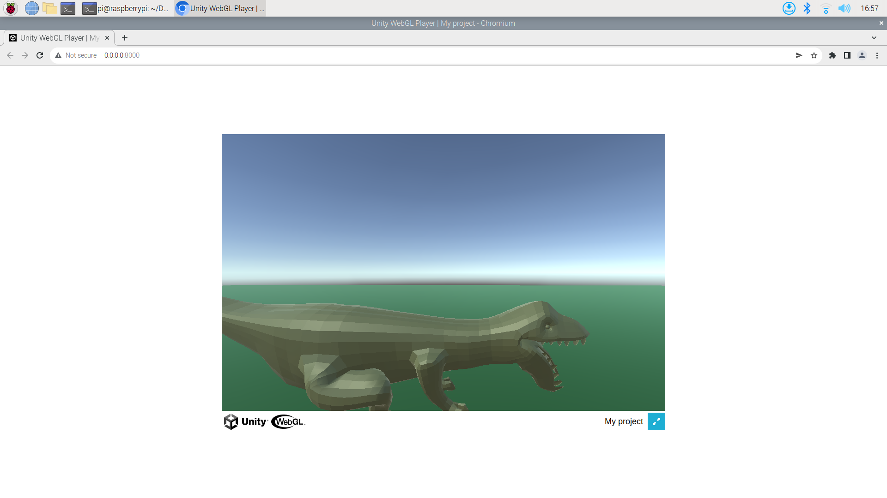

# Unity Project

You should be able to just open this directory in the Unity Editor.

## Notable files

[websockets.jslib](./Assets/Plugins/websockets.jslib)
Provides javascript functions to unity

[WebSockets.cs](./Assets/Scripts/WebSockets.cs)
Receives calls from javascript and does stuff

## Getting this on the Pi

1. [Not on the PI] From the Unity editor, export to WebGL.
2. Move the exported project to the PI (Should be zipped).
3. Unzip on the Pi, the created directory should contain a file name index.html
```bash
unzip [Name of File]
```
4. Change directory to Build in the newly unzipped directory.
5. Decompress all gzipped files.
``` bash
gzip -d *.gz
```
6. Edit index.html, removing the .gz extensions in references to the files just decompressed
```html
 var config = {
        dataUrl: buildUrl + "/web-build.data.gz", <!-- make this "/web-build.data" -->
        frameworkUrl: buildUrl + "/web-build.framework.js.gz", <!-- make this "/web-build.framework.js" -->
        codeUrl: buildUrl + "/web-build.wasm.gz", <!-- make this "/web-build.wasm" -->
		<!-- CONTINUES -->
      };
```
7. The Unity Project needs to be served by a Web Server for it to run in the browser. Run from the directory containing *index.html*.
``` bash
python3 -m http.server
```
8. Now you should be able to visit the address python returns to see the Unity Project running.


## Image of T-Rex on WebGL

